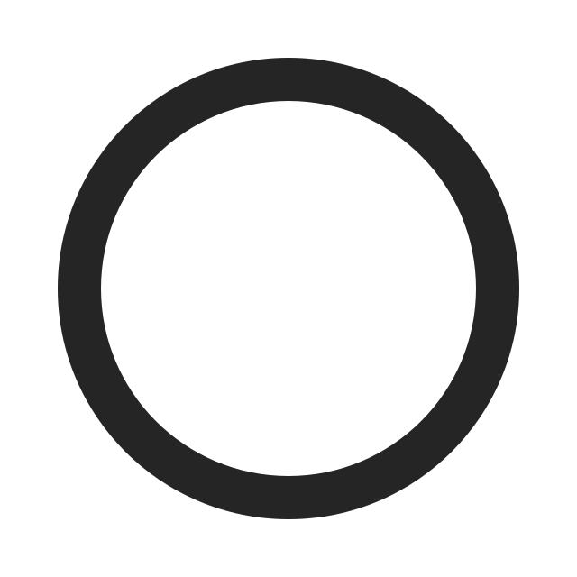
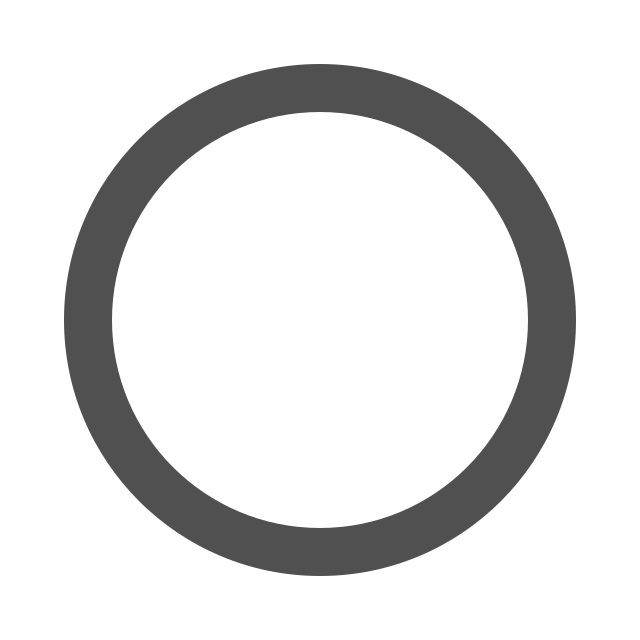
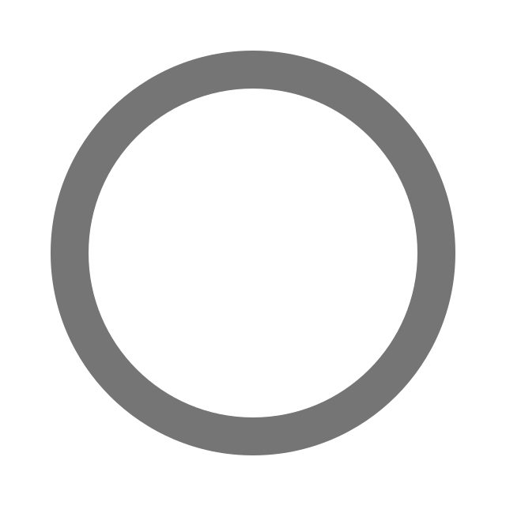
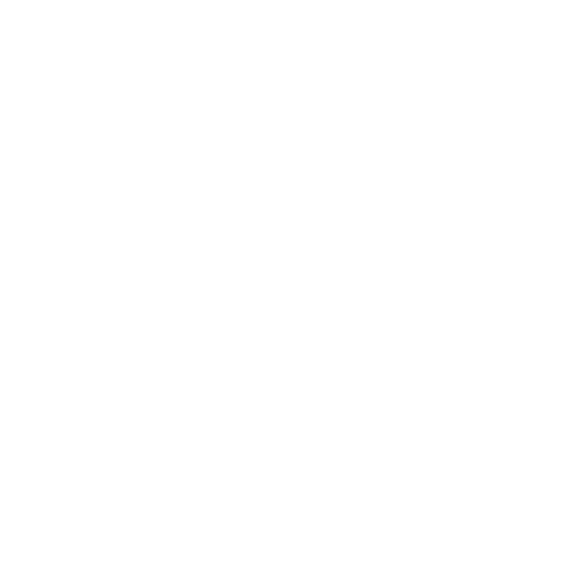
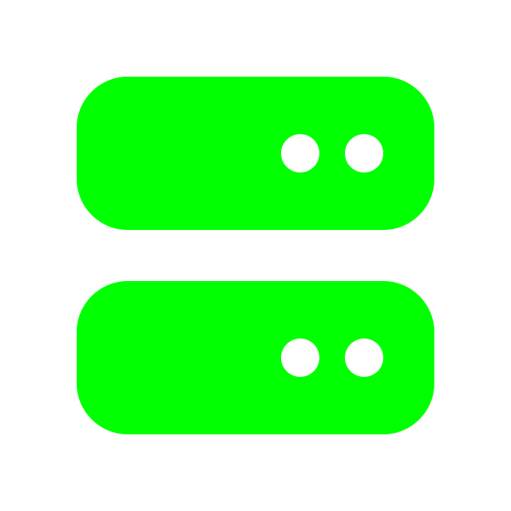

# coderrquitsreality | Brand Kit

This repository serves as the central hub for all **coderrquitsreality** branding materials, including color palettes, CSS variables, and image assets. 

> The brand relies on a terminal-style, cyberpunk, futuristic, techwear aesthetic with furry art. Imagery may not be suitable for all ages. All media is SFW in accordance with RTA.

---

## <i class="fa-solid fa-share-nodes"></i> Social Media
* **Twitter / X:** [@coderrquitsrlty](https://twitter.com/@coderrquitsrlty)
* **YouTube:** [coderrquitsreality_](https://www.youtube.com/c/coderrquitsreality_)
* **Discord:** [coderrquitsreality_](https://discord.com/users/846055297524826162)

## <i class="fa-solid fa-palette"></i> Color Palette

###  Console Lime - `#00ff00`
###  Console Blue - `#0000ff`
###  Void Black - `#000000`
###  Dark Grey - `#252525`
###  Light Grey - `#505050`
###  Lighter Grey - `#757575`
###  Literally just white - `#ffffff`

## <i class="fa-solid fa-palette"></i> Banner
## <i class="fa-solid fa-palette"></i> PFP
## <i class="fa-solid fa-palette"></i> Emoji

## <i class="fa-solid fa-palette"></i> Domain
###  Domain - `coderrquitsreality.dev`

## <i class="fa-solid fa-palette"></i> Internet Resources
###  AS Number - `AS207719`
###  IPv6 Network - `2a14:7583:6969::/48`

## <i class="fa-solid fa-palette"></i> Email
###  Email - `me@coderrquitsreality.dev`
###  Email - `dmca@coderrquitsreality.dev`
